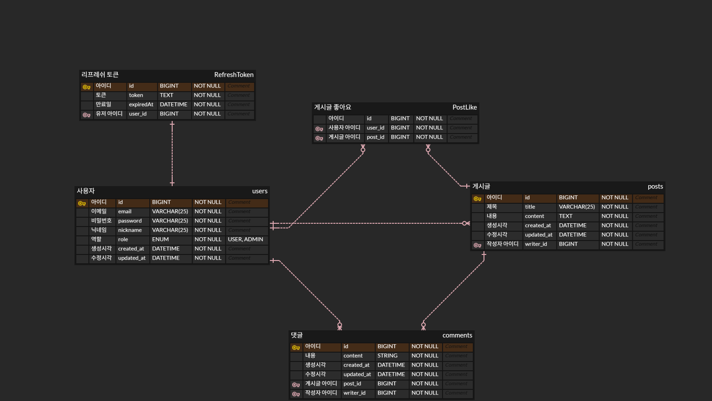

# AppJam Auth Board

> AppJam 프로젝트를 준비하기 위해 Spring Boot 기반으로 인증/인가, JWT, OAuth2, JPA를 학습하고 구현하는 백엔드 연습 프로젝트입니다.

이 프로젝트는 **모듈러식 모놀리스(Modular Monolith)** 구조를 기반으로 합니다.
서비스를 여러 개로 분리해 각각 실행하는 MSA 방식이 아니라, **하나의 Spring Boot 애플리케이션 안에서 기능별 모듈을 분리**하는 방식으로 설계합니다.

---

## 📌 프로젝트 목적

이 프로젝트는 AppJam과 같은 단기 협업 프로젝트에서 자주 사용되는 백엔드 기능을 미리 학습하고 구현하기 위해 시작했습니다.

주요 학습 목표는 다음과 같습니다.

* Spring Data JPA를 활용한 도메인 설계 및 CRUD 구현
* 모듈러식 모놀리스 구조에서 도메인별 모듈 분리 연습
* Spring Security 기반 인증/인가 흐름 이해
* JWT Access Token / Refresh Token 발급 및 검증
* 로그인한 사용자 기준의 게시글, 댓글, 좋아요 기능 구현
* OAuth2 소셜 로그인 흐름 학습
* 실전 프로젝트에 가까운 패키지 구조와 API 설계 연습

---

## 🧱 Architecture

### Modular Monolith

이 프로젝트는 하나의 애플리케이션으로 실행되지만, 내부 코드는 기능별 모듈로 분리합니다.

```text
AppJam Auth Board
 ├── app
 │   └── 애플리케이션 실행 모듈
 │
 ├── auth
 │   └── 회원가입, 로그인, JWT, Refresh Token 담당
 │
 ├── board
 │   └── 게시글, 댓글, 좋아요 담당
 │
 └── common
     └── 공통 응답, 공통 예외, 공통 유틸 담당
```

### MSA와의 차이

```text
MSA
- 서비스별로 서버를 따로 실행한다.
- 서비스별 DB를 분리하는 경우가 많다.
- 서비스 간 통신이 HTTP, 메시지 큐 등을 통해 이루어진다.
- Gateway, Service Discovery 등의 구성이 필요할 수 있다.

Modular Monolith
- 서버는 하나만 실행한다.
- 내부 코드를 기능별 모듈로 나눈다.
- 모듈 간 의존성을 관리하면서 구조를 유지한다.
- 초기 학습과 AppJam 대비용 프로젝트에 적합하다.
```

이 프로젝트에서는 **서버를 하나만 실행**하고, 내부에서 `auth`, `board`, `common` 모듈을 분리합니다.

---

## 🛠 Tech Stack

### Backend

* Java 17
* Spring Boot 3.x
* Spring Security
* Spring Data JPA
* JWT
* OAuth2 Client
* MySQL
* H2 Database
* Gradle Multi Module

### Tool

* IntelliJ IDEA
* Postman
* Git / GitHub
* Swagger

---

## 🧩 주요 기능

### Auth

* 회원가입
* 로그인
* Access Token 발급
* Refresh Token 발급
* 토큰 재발급
* 로그아웃
* OAuth2 소셜 로그인

### User

* 내 정보 조회
* 닉네임 수정

### Post

* 게시글 작성
* 게시글 목록 조회
* 게시글 상세 조회
* 게시글 수정
* 게시글 삭제

### Comment

* 댓글 작성
* 댓글 삭제

### Like

* 게시글 좋아요
* 게시글 좋아요 취소
* 중복 좋아요 방지

---

## 🗂 Module Structure

```text
appjam-auth-board
 ├── settings.gradle
 ├── build.gradle
 ├── README.md
 │
 ├── app
 │   ├── build.gradle
 │   └── src/main/java/org/sopt/appjam
 │       └── AppjamApplication.java
 │
 ├── auth
 │   ├── build.gradle
 │   └── src/main/java/org/sopt/auth
 │       ├── controller
 │       ├── service
 │       ├── repository
 │       ├── entity
 │       └── dto
 │
 ├── board
 │   ├── build.gradle
 │   └── src/main/java/org/sopt/board
 │       ├── post
 │       │   ├── controller
 │       │   ├── service
 │       │   ├── repository
 │       │   ├── entity
 │       │   └── dto
 │       ├── comment
 │       │   ├── controller
 │       │   ├── service
 │       │   ├── repository
 │       │   ├── entity
 │       │   └── dto
 │       └── like
 │           ├── controller
 │           ├── service
 │           ├── repository
 │           ├── entity
 │           └── dto
 │
 └── common
     ├── build.gradle
     └── src/main/java/org/sopt/common
         ├── response
         ├── exception
         └── util
```

---

## 📦 Module Responsibility

### app

애플리케이션 실행을 담당하는 모듈입니다.

* Spring Boot Application 실행
* 전체 모듈 조립
* `auth`, `board`, `common` 모듈 의존
* 공통 설정 등록

### auth

인증과 사용자 관련 기능을 담당하는 모듈입니다.

* 회원가입
* 로그인
* 사용자 정보 관리
* 비밀번호 암호화
* JWT 발급
* Refresh Token 관리
* OAuth2 로그인

### board

게시판 관련 기능을 담당하는 모듈입니다.

* 게시글 CRUD
* 댓글 작성/삭제
* 게시글 좋아요/좋아요 취소
* 작성자 권한 검증

### common

여러 모듈에서 공통으로 사용하는 코드를 담당하는 모듈입니다.

* 공통 응답 형식
* 공통 예외 처리
* ErrorCode
* 공통 유틸

---

## 🧱 ERD

<p align="center">
  
</p>

현재 ERD는 인증 게시판 기능을 기준으로 설계했습니다.

- `users`: 회원 정보 관리
- `posts`: 게시글 정보 관리
- `comments`: 게시글 댓글 관리
- `post_like`: 게시글 좋아요 관리
- `refresh_token`: Refresh Token 저장 및 재발급 관리

### 관계

```text
User 1 : N Post
User 1 : N Comment
User 1 : N PostLike
User 1 : 1 RefreshToken

Post 1 : N Comment
Post 1 : N PostLike
```

---

## 🔐 인증 흐름

```text
1. 사용자가 로그인 요청을 보냅니다.
2. 서버는 이메일과 비밀번호를 검증합니다.
3. 검증에 성공하면 Access Token과 Refresh Token을 발급합니다.
4. Refresh Token은 DB에 저장합니다.
5. 클라이언트는 Access Token을 Authorization Header에 담아 요청합니다.
6. JwtAuthenticationFilter가 요청을 가로채 토큰을 검증합니다.
7. 토큰이 유효하면 userId를 추출합니다.
8. SecurityContext에 인증 정보를 저장합니다.
9. Controller에서는 로그인한 사용자 정보를 기반으로 API를 처리합니다.
```

---

## 📡 API 명세

### Auth

| Method | URL                 | Description | Auth |
| ------ | ------------------- | ----------- | ---- |
| POST   | `/api/auth/signup`  | 회원가입        | X    |
| POST   | `/api/auth/login`   | 로그인         | X    |
| POST   | `/api/auth/reissue` | 토큰 재발급      | X    |
| POST   | `/api/auth/logout`  | 로그아웃        | O    |

### User

| Method | URL             | Description | Auth |
| ------ | --------------- | ----------- | ---- |
| GET    | `/api/users/me` | 내 정보 조회     | O    |
| PATCH  | `/api/users/me` | 내 정보 수정     | O    |

### Post

| Method | URL                   | Description | Auth |
| ------ | --------------------- | ----------- | ---- |
| GET    | `/api/posts`          | 게시글 목록 조회   | X    |
| GET    | `/api/posts/{postId}` | 게시글 상세 조회   | X    |
| POST   | `/api/posts`          | 게시글 작성      | O    |
| PATCH  | `/api/posts/{postId}` | 게시글 수정      | O    |
| DELETE | `/api/posts/{postId}` | 게시글 삭제      | O    |

### Comment

| Method | URL                            | Description | Auth |
| ------ | ------------------------------ | ----------- | ---- |
| POST   | `/api/posts/{postId}/comments` | 댓글 작성       | O    |
| DELETE | `/api/comments/{commentId}`    | 댓글 삭제       | O    |

### Like

| Method | URL                         | Description | Auth |
| ------ | --------------------------- | ----------- | ---- |
| POST   | `/api/posts/{postId}/likes` | 게시글 좋아요     | O    |
| DELETE | `/api/posts/{postId}/likes` | 게시글 좋아요 취소  | O    |

---

## 🚀 실행 방법

### 1. Repository Clone

```bash
git clone https://github.com/사용자이름/appjam-auth-board.git
cd appjam-auth-board
```

### 2. 환경 변수 설정

`application.yml` 또는 `.env`에 아래 값을 설정합니다.

```yml
spring:
  h2:
    console:
      enabled: true
      path: /h2-console

  datasource:
    url: ${H2_DATASOURCE_URL:jdbc:h2:mem:testdb}
    driver-class-name: ${H2_DATASOURCE_DRIVER:org.h2.Driver}
    username: ${H2_DATASOURCE_USERNAME:sa}
    password: ${H2_DATASOURCE_PASSWORD:}

  jpa:
    hibernate:
      ddl-auto: create
    properties:
      hibernate:
        format_sql: true
        show_sql: true

server:
  port: 8080
```

### 3. 실행

모듈러식 모놀리스 구조에서는 `app` 모듈 하나만 실행합니다.

```bash
./gradlew :app:bootRun
```

Windows PowerShell에서는 다음 명령어를 사용합니다.

```bash
.\gradlew :app:bootRun
```

---

## ✅ 학습 체크리스트

### Modular Monolith

* [ ] Gradle 멀티 모듈 구조 이해
* [ ] 실행 모듈과 도메인 모듈 분리
* [ ] `app`, `auth`, `board`, `common` 역할 분리
* [ ] 모듈 간 의존성 방향 정리
* [ ] `implementation project(':module')` 이해
* [ ] Component Scan 범위 이해

### JPA

* [x] Entity 설계
* [x] Repository 작성
* [x] DTO 변환
* [x] `@Transactional` 이해
* [ ] 연관관계 매핑
* [ ] 더티 체킹 이해
* [ ] N+1 문제 확인

### Auth

* [ ] User 도메인 구현
* [ ] 회원가입 구현
* [ ] 비밀번호 암호화
* [ ] 로그인 구현
* [ ] Access Token 발급
* [ ] Refresh Token 발급
* [ ] 토큰 재발급 구현

### Spring Security

* [ ] SecurityConfig 작성
* [ ] JWT Filter 구현
* [ ] 인증이 필요한 API와 필요 없는 API 분리
* [ ] 로그인한 사용자 정보 조회
* [ ] 작성자 권한 검증

### OAuth2

* [ ] Google OAuth2 로그인
* [ ] Kakao OAuth2 로그인
* [ ] 소셜 로그인 성공 후 JWT 발급
* [ ] 신규 사용자 자동 회원가입 처리

---

## 🧠 배운 점 정리

프로젝트를 진행하면서 배운 내용을 아래에 정리합니다.

### Modular Monolith

* MSA와 모듈러식 모놀리스의 차이
* 서버는 하나만 실행하고 내부 모듈을 분리하는 이유
* 모듈 간 의존성 방향을 관리해야 하는 이유
* 실행 모듈과 도메인 모듈을 분리하는 이유

### JPA

* Entity와 DTO를 분리해야 하는 이유
* Repository는 DB 접근을 담당하고, Entity는 자신의 상태 변경을 담당한다는 점
* `@Transactional` 안에서 더티 체킹으로 UPDATE가 발생하는 흐름
* Repository 메서드 네이밍 규칙

### JWT

* Access Token과 Refresh Token의 차이
* Authorization Header에서 Bearer Token을 추출하는 방법
* 토큰 만료와 재발급 흐름
* Access Token은 DB에 저장하지 않고, Refresh Token은 DB에 저장하는 이유

### Spring Security

* Security Filter Chain의 역할
* JWT 인증 필터가 동작하는 위치
* `SecurityContextHolder`에 인증 정보를 저장하는 이유
* 인증과 인가의 차이

### OAuth2

* OAuth2 로그인과 JWT 인증의 차이
* 소셜 로그인 성공 후 우리 서비스의 JWT를 발급해야 하는 이유

---

## 📝 Commit Convention

```text
feat: 새로운 기능 추가
fix: 버그 수정
refactor: 코드 리팩토링
docs: 문서 수정
test: 테스트 코드 추가
chore: 설정 변경
```

예시:

```bash
git commit -m "feat: 회원가입 API 구현"
git commit -m "feat: JWT 토큰 발급 기능 구현"
git commit -m "fix: 게시글 수정 권한 검증 오류 해결"
git commit -m "refactor: 모듈러식 모놀리스 구조로 변경"
```

---

## 📍 진행 상황

* [x] 프로젝트 초기 세팅
* [x] Post 도메인 구현
* [x] 게시글 CRUD 구현
* [ ] 모듈러식 모놀리스 구조 정리
* [ ] app 모듈 생성
* [ ] auth 모듈 정리
* [ ] board 모듈 정리
* [ ] common 모듈 정리
* [ ] User 도메인 구현
* [ ] 회원가입 구현
* [ ] 비밀번호 암호화 구현
* [ ] 로그인 구현
* [ ] JWT 발급 구현
* [ ] Refresh Token 구현
* [ ] Spring Security 적용
* [ ] 작성자 권한 검증
* [ ] Comment 도메인 구현
* [ ] Like 도메인 구현
* [ ] OAuth2 로그인 구현
* [ ] Swagger API 문서화
* [ ] 배포
